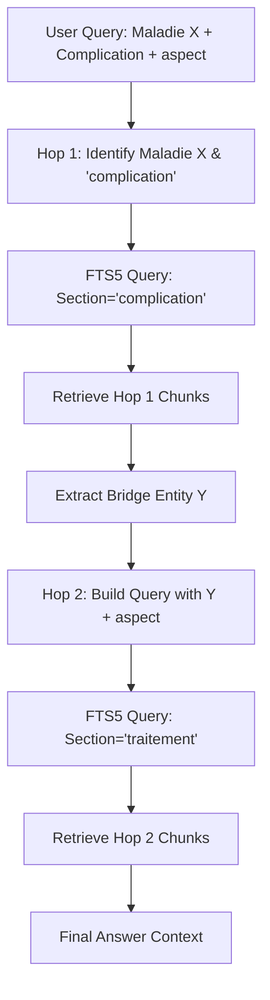

# Multi-Hop Lexical Retrieval Pipeline for French Medical Q&A (EDN Prep)

This document details the architecture, query reformulation strategies, schema design, concrete SQL implementation, and failure mode mitigations for a 2-hop SQLite FTS5 retrieval pipeline. The design is optimized for sub-200ms execution budgets in lightweight environments such as Cloudflare Workers or local edge processes.

---

## 1. Pipeline Architecture

A single-shot BM25 search fails on questions like: *"Quelle est la prise en charge de la complication la plus fréquente de la maladie X ?"* because the target ("prise en charge") is grammatically and semantically linked to a bridge entity ("complication la plus fréquente") which is itself defined only in relation to the main entity ("maladie X"). 

To resolve this, we implement a **2-hop retrieval pipeline**:



### Stages & Hop Query Formulation
1. **Input Analysis & Classification**: The incoming user query is parsed to identify the core subject (Disease $X$), the target relationship (e.g., "complication"), and the target aspect (e.g., "prise en charge", "traitement", "diagnostic").
2. **Hop 1 (Bridge Entity Retrieval)**:
   - **Query Formulation**: Constructed using the disease term $X$ and the relation keywords, combined with proximity and logical operators.
   - **FTS5 Query Structure**: `disease_term AND (complication* OR fréquente*)`
   - **Filtering**: Constrained by metadata to sections labeled as `complications`, `clinique`, or `diagnostic`.
   - **Output**: The top-3 chunks containing definition/discussion of the complications of $X$.
3. **Bridge Entity Extraction**:
   - The top chunks from Hop 1 are scanned to extract the specific bridge entity $Y$ (e.g., identifying that the most frequent complication of Graves' disease is *orbitopathie dysthyroïdienne*).
4. **Hop 2 (Target Aspect Retrieval)**:
   - **Query Formulation**: Constructed using the extracted bridge entity $Y$ and the target aspect terms (e.g., "prise en charge", "traitement").
   - **FTS5 Query Structure**: `"bridge_entity_Y" AND (traitement* OR "prise en charge" OR therapeutique*)`
   - **Filtering**: Constrained by metadata to sections matching `traitement` or `prise_en_charge`.
   - **Output**: The top chunks containing the actual treatment protocol for the complication.

### Stopping Criteria
* **Zero Results**: If Hop 1 yields no hits above a baseline BM25 score (e.g., `score > -3.0`), the search halts and falls back to a broad single-shot query.
* **Low Confidence Bridge Entity**: If extraction fails to isolate a medical noun phrase from the Hop 1 output, the pipeline stops and defaults to returning the Hop 1 results.
* **Max Hops**: Capped strictly at **2 hops** to guarantee completion within the budget.

### Performance & Budgets
* **Database Size**: ~40k chunks, SQLite file size ~50-80MB (fully cacheable in memory).
* **FTS5 Query Latency**: <5ms per query.
* **JS Extraction/Overhead (Cloudflare Worker)**: <10ms.
* **Total Lexical Pipeline Latency**: **<25ms**, comfortably under the 200ms budget.

---

## 2. Query Reformulation Strategy

We compare a pure lexical/structural strategy with a small LLM-in-the-loop strategy.

### Strategy A: Pure Lexical / Structural (No-LLM)
This strategy relies on deterministic rules, regular expressions, and light NLP to isolate entities and construct queries.

1. **Entity & Aspect Extraction**:
   - Strip French stop words (e.g., *de, la, le, les, pour, dans*).
   - Match query templates via regular expressions:
     - Template: `prise en charge de la complication la plus fréquente de [X]`
     - Extraction: Disease = `[X]`, Relation = `complication fréquente`, Aspect = `prise en charge`.
2. **Hop 1 Query Generation**:
   - Query: `X NEAR/5 complication`
   - Filter: `section_type = 'complications'`
3. **Bridge Entity Extraction**:
   - Simple lexical scanner looks for assertion patterns in the retrieved chunk text:
     - Pattern 1: `la complication la plus fréquente est (l'|la|le) ([A-Za-zÀ-ÿ\s'-]+)`
     - Pattern 2: `[X] se complique principalement de ([A-Za-zÀ-ÿ\s'-]+)`
     - If matched, the captured group becomes $Y$. If no regex matches, we take the highest-scoring noun-phrase co-occurring with "complication".
4. **Hop 2 Query Generation**:
   - Query: `Y AND ("prise en charge" OR "traitement" OR "therapeutique")`
   - Filter: `section_type = 'traitement'`

### Strategy B: Small LLM Reformulator (LLM-in-the-loop)
A small, fast LLM (e.g., `Llama-3-8B` or `GPT-4o-mini` / `Claude-3-Haiku` via API) is used at the boundaries of the hops.

1. **Hop 1 Parse**:
   - Prompt: *"Extrais la maladie principale (X), la relation recherchée, et l'aspect final depuis cette question : '{query}'. Réponds uniquement en JSON: {'maladie': '...', 'relation': '...', 'aspect': '...'}"*
2. **Hop 2 Bridge Extraction**:
   - Prompt: *"Voici les extraits médicaux suivants. Identifie quelle est la relation recherchée (ex: la complication la plus fréquente de X). Extrais uniquement le nom exact de cette entité cible. Extraits: {hop_1_text}"*
3. **Query Construction**:
   - The LLM outputs the clean entity $Y$ and reformulates the FTS5 query terms.

### Comparative Analysis

| Metric | Strategy A: Lexical/Structural | Strategy B: Small LLM Reformulator |
| :--- | :--- | :--- |
| **Latency** | **5–15 ms** (Ultra-fast local execution) | **180–400 ms** (LLM inference + API network roundtrips) |
| **Cost** | **$0.00** (Free, runs entirely on CPU/Worker) | **~$0.001 per user query** (API usage fees) |
| **Accuracy** | **Medium-High** on standard EDN question patterns; fails on highly indirect phrasing. | **Very High**; handles complex synonymy and semantic shifts naturally. |
| **Resource Footprint** | Extremely low; easily fits within 128MB Cloudflare Worker limit. | Medium; requires API keys or hosted model instance. |
| **Verdict** | **Preferred** for edge environments (Cloudflare Workers) with strict <200ms budgets. | Suitable for backend environments where latency constraints are relaxed to ~500ms. |

---

## 3. Exact SQLite Schema

To exploit structured metadata (item number, specialty, section headers) during our FTS5 searches, we use an **External Content Table** pattern. This separates metadata storage and indexing from the virtual FTS table, keeping the database size small and queries highly performant.

```sql
-- Disable auto-indexing warnings and set optimal performance PRAGMAs
PRAGMA journal_mode = WAL;
PRAGMA synchronous = NORMAL;

-- 1. Base Metadata and Content Table
CREATE TABLE chunks (
    id INTEGER PRIMARY KEY AUTOINCREMENT,
    item_number INTEGER NOT NULL,               -- EDN Item Number (e.g., 245)
    specialty TEXT NOT NULL,                   -- e.g., 'Endocrinologie'
    section_header TEXT NOT NULL,              -- e.g., '1. Orbitopathie dysthyroïdienne'
    section_type TEXT NOT NULL,                -- Normalised: 'definition', 'complication', 'traitement', 'diagnostic'
    chunk_text TEXT NOT NULL                   -- The actual paragraph content
);

-- 2. Indexes for Fast Metadata Filtering
CREATE INDEX idx_chunks_metadata ON chunks (item_number, specialty, section_type);

-- 3. FTS5 Virtual Table (External Content pointing to 'chunks')
-- We use the 'unicode61' tokenizer to handle accents/diacritics transparently.
CREATE VIRTUAL TABLE chunks_fts USING fts5(
    chunk_text,
    content='chunks',
    content_rowid='id',
    tokenize='unicode61 remove_diacritics 1'
);

-- 4. Triggers to Keep FTS5 Virtual Table Synced with Base Table
CREATE TRIGGER chunks_ai AFTER INSERT ON chunks BEGIN
    INSERT INTO chunks_fts(rowid, chunk_text) VALUES (new.id, new.chunk_text);
END;

CREATE TRIGGER chunks_ad AFTER DELETE ON chunks BEGIN
    INSERT INTO chunks_fts(chunks_fts, rowid, chunk_text) VALUES('delete', old.id, old.chunk_text);
END;

CREATE TRIGGER chunks_au AFTER UPDATE ON chunks BEGIN
    INSERT INTO chunks_fts(chunks_fts, rowid, chunk_text) VALUES('delete', old.id, old.chunk_text);
    INSERT INTO chunks_fts(rowid, chunk_text) VALUES (new.id, new.chunk_text);
END;
```

---

## 4. Concrete SQL & Worked Example

**Question**: *"Quelle est la prise en charge de la complication la plus fréquente de la maladie de Graves ?"*

### Plausible Target Chunk Data
We assume the database has been populated with these two records:

```sql
INSERT INTO chunks (id, item_number, specialty, section_header, section_type, chunk_text) VALUES
(101, 245, 'Endocrinologie', 'Complications de la maladie de Graves', 'complication', 
 'La maladie de Graves (Basedow) est une pathologie auto-immune. L''orbitopathie dysthyroïdienne est la complication la plus fréquente et la plus spécifique de cette affection.'),

(202, 245, 'Endocrinologie', 'Prise en charge de l''orbitopathie dysthyroïdienne', 'traitement', 
 'La prise en charge de l''orbitopathie dysthyroïdienne repose sur l''arrêt du tabac, des mesures locales, et une corticothérapie intraveineuse dans les formes sévères.');
```

### Hop 1: Identify the Bridge Entity
We run an FTS5 search restricted to the `'complication'` section type to find the complication of Graves/Basedow.

```sql
SELECT c.id, c.chunk_text, bm25(chunks_fts) as score
FROM chunks c
JOIN chunks_fts f ON c.id = f.rowid
WHERE chunks_fts MATCH 'Graves OR Basedow AND complication'
  AND c.section_type = 'complication'
ORDER BY score
LIMIT 1;
```

#### Hop 1 Output Text:
> *"La maladie de Graves (Basedow) est une pathologie auto-immune. L'orbitopathie dysthyroïdienne est la complication la plus fréquente et la plus spécifique de cette affection."*

#### Extraction of Bridge Entity:
* The regex matching engine scans the retrieved chunk for `la complication la plus fréquente ... est ([A-Za-zÀ-ÿ\s'-]+)`.
* It extracts: **"orbitopathie dysthyroïdienne"**.

---

### Hop 2: Retrieve Management of the Bridge Entity
Using the extracted bridge entity, we query the `'traitement'` section type to find its management.

```sql
SELECT c.section_header, c.chunk_text, bm25(chunks_fts) as score
FROM chunks c
JOIN chunks_fts f ON c.id = f.rowid
WHERE chunks_fts MATCH '"orbitopathie dysthyroïdienne" AND ("prise en charge" OR "traitement")'
  AND c.section_type = 'traitement'
ORDER BY score
LIMIT 1;
```

#### Hop 2 Final Results:
* **Section**: *Prise en charge de l'orbitopathie dysthyroïdienne*
* **Text**: *"La prise en charge de l'orbitopathie dysthyroïdienne repose sur l'arrêt du tabac, des mesures locales, et une corticothérapie intraveineuse dans les formes sévères."*

---

## 5. Failure Modes and Mitigation Strategies

### 1. Entity Extraction Failure due to Pronoun Resolution or Indirect Phrasing
* **Failure Description**: The Hop 1 text says: *"La maladie de X est grave. Sa complication la plus fréquente est la néphropathie."* A regex parsing pattern looking for `"complication... de [X]"` will miss the pronoun reference *"Sa"*.
* **Mitigation**: Implement a fallback lexical sliding window. If direct pattern matching fails, extract all noun-phrases following the keyword *"complication"* within a 10-word window. Then, cross-reference these candidate nouns against a pre-loaded local index of medical terms (such as common French disease suffixes/endings: `-patie`, `-te`, `-ose`).

### 2. Synonym Mismatch in Hop 2
* **Failure Description**: The bridge entity is extracted as *"orbitopathie dysthyroïdienne"*, but the treatment chunk only uses the synonym *"ophtalmopathie de Basedow"*, leading to 0 hits in Hop 2.
* **Mitigation**: Integrate a lightweight, offline synonym map in the worker application. When querying FTS5 in Hop 2, expand the target bridge terms using logical OR: `("orbitopathie dysthyroïdienne" OR "ophtalmopathie de Basedow" OR "ophtalmopathie dysthyroïdienne")`.

### 3. Misclassified Section Metadata
* **Failure Description**: The chunk detailing the complication is stored under `section_type = 'clinique'` instead of `complication` due to upstream parsing issues, resulting in Hop 1 returning empty results.
* **Mitigation**: Implement a **Query Cascading Fallback**. If a query targeting `section_type = 'complication'` returns empty results, automatically relax the query parameters in a second attempt by removing the section metadata constraint and querying across all sections, while applying a slight penalty (`* 1.2`) to the BM25 rank score of non-specialized sections.
