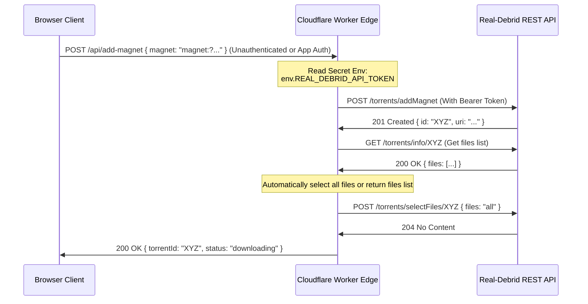

# Real-Debrid TypeScript Client for Cloudflare Workers

This document details the implementation of a TypeScript client module for the Real-Debrid REST API designed specifically for the Cloudflare Workers runtime. It addresses rate-limiting constraints in stateless execution models, defines a clear error taxonomy, analyzes API idempotency, and presents a secure Worker boundary design.

---

## 1. Cloudflare Workers Rate Limiting Analysis & Solution Design

### The Execution Model Constraint
Cloudflare Workers run on V8 isolates rather than containerized processes. 
- **Stateless & Ephemeral**: Isolates spin up and down dynamically depending on global traffic patterns. Memory is not shared between isolates, and the global scope is reset whenever an isolate is recycled.
- **No Shared Event Loop**: Traditional node-based client-side limiters rely on persistent timers (`setInterval` or `setTimeout`) running in a single process. In Workers, if a request completes, the execution context is frozen or killed; there is no background thread to steadily refill tokens or manage a global queue across requests.
- **Concurrency**: Multiple isolates in different edge data centers run concurrently. An in-memory rate limiter on one isolate will not know about requests processed by another isolate.

### Architectural Trade-offs for Rate Limiting

| Solution | Implementation Style | Pros | Cons | When to Use |
| :--- | :--- | :--- | :--- | :--- |
| **Durable Objects (DO) Token Bucket** | Single stateful coordinator coordinate rate limits. | Strictly enforces the global 250 req/min limit across all global isolates. | Requires a paid Cloudflare plan; adds internal latency (cross-isolate network hop). | High-traffic Workers serving many concurrent clients where exceeding the limit risks API bans. |
| **Per-Isolate Best-Effort** | In-memory token bucket inside the Worker's global scope. | Zero external latency, zero cost. | Under-limits if isolates are recycled frequently; over-limits if multiple isolates run in parallel. | Low-traffic, single-user Workers, or cron-triggered background queue Workers. |
| **Upstream 429 Handling with Jittered Backoff** | Intercept `429 Too Many Requests` and apply delay using the `Retry-After` header. | Simple, reactive, guarantees we don't spam the API when blocked. | Latency occurs at the request boundaries; does not proactively prevent hitting the rate limit. | Always, as a fallback defense-in-depth mechanism. |

*In the client below, we implement a **Per-Isolate Best-Effort Token Bucket** combined with **Upstream 429 Handling**, and provide the conceptual blueprint for a **Durable Object Token Bucket**.*

---

## 2. Idempotency & Retry Safety Analysis

When transient errors (e.g., 502 Bad Gateway, 503 Service Unavailable, 504 Gateway Timeout, or TCP connection resets) occur, retrying the request is only safe if the endpoint is **idempotent**.

| Endpoint | Method | Path | Retry-Safe? | Rationale |
| :--- | :--- | :--- | :--- | :--- |
| **Unrestrict Link** | `POST` | `/unrestrict/link` | **Yes (Conditional)** | Retrying with the same link will return the same unrestrict object. However, doing so repeatedly could theoretically consume daily traffic quotas if Real-Debrid does not cache the result. It is safe to retry on transient 5xx errors. |
| **Add Magnet** | `POST` | `/torrents/addMagnet` | **No** | **This is NOT retry-safe.** If a timeout occurs after the server processes the request but before the client receives the response, retrying will add the magnet again. This results in duplicate torrent jobs on the account, generating different torrent IDs. **Mitigation**: Do not retry automatically. The caller should catch the failure and either list torrents to check if the magnet hash already exists, or let the user handle duplicates. |
| **Select Files** | `POST` | `/torrents/selectFiles/{id}` | **Yes** | Selecting files for a specific torrent ID is state-setting. Sending the same list of file IDs multiple times to the same torrent ID results in the same state. |
| **Get Torrent Info** | `GET` | `/torrents/info/{id}` | **Yes** | Read-only operation. Safe to retry. |
| **List Downloads** | `GET` | `/downloads` | **Yes** | Read-only operation. Safe to retry. |

---

## 3. TypeScript Real-Debrid Client Implementation

Below is the complete client code, written in TypeScript with no external dependencies (using `fetch` only). Save this file as `realDebridClient.ts`.

```typescript
// ============================================================================
// 1. Error Taxonomy
// ============================================================================

export abstract class RealDebridError extends Error {
  constructor(message: string, public readonly status?: number) {
    super(message);
    this.name = this.constructor.name;
    Object.setPrototypeOf(this, new.target.prototype);
  }
}

export class RealDebridAuthError extends RealDebridError {
  constructor(message = "Unauthorized: API token is invalid or expired") {
    super(message, 401);
  }
}

export class RealDebridPremiumError extends RealDebridError {
  constructor(message = "Forbidden: Premium account or specific permissions required") {
    super(message, 403);
  }
}

export class RealDebridInfringingError extends RealDebridError {
  constructor(message = "File is unavailable due to infringement or copyright claim") {
    super(message, 403);
  }
}

export class RealDebridRateLimitError extends RealDebridError {
  constructor(public readonly retryAfterSeconds: number, message = "Too many requests. Rate limit exceeded.") {
    super(message, 429);
  }
}

export class RealDebridTransientError extends RealDebridError {
  constructor(message = "Transient upstream error", status = 503) {
    super(message, status);
  }
}

export class RealDebridHttpError extends RealDebridError {
  constructor(status: number, message: string) {
    super(`HTTP Error ${status}: ${message}`, status);
  }
}

// ============================================================================
// 2. Types & Interfaces
// ============================================================================

export type TorrentStatus =
  | "magnet_conversion"
  | "waiting_files_selection"
  | "queued"
  | "downloading"
  | "downloaded"
  | "error"
  | "virus"
  | "dead";

export interface UnrestrictLinkResponse {
  id: string;
  filename: string;
  mimeType: string;
  filesize: number;
  link: string; // The unrestricted link
  host: string;
  chunks: number;
  download: string;
  streamable: number;
}

export interface AddMagnetResponse {
  id: string;
  uri: string;
}

export interface TorrentFile {
  id: number;
  path: string;
  bytes: number;
  selected: number;
}

export interface TorrentInfo {
  id: string;
  filename: string;
  original_filename: string;
  hash: string;
  bytes: number;
  original_bytes: number;
  host: string;
  split: number;
  progress: number;
  status: TorrentStatus;
  statusCode?: number;
  added: string;
  files: TorrentFile[];
  links: string[];
  ended?: string;
  speed?: number;
  seeders?: number;
}

export interface DownloadItem {
  id: string;
  filename: string;
  mimeType: string;
  filesize: number;
  link: string;
  host: string;
  chunks: number;
  download: string;
  streamable: number;
  generated: string;
}

export interface RateLimiter {
  acquire(tokens?: number): Promise<void>;
  report429(retryAfterSeconds: number): void;
}

export interface PollOptions {
  timeoutMs?: number;         // Hard timeout for the polling operation
  initialDelayMs?: number;    // Initial delay before first poll / step
  maxDelayMs?: number;        // Max backoff delay between polls
  backoffFactor?: number;     // Exponential factor
  jitter?: boolean;           // Apply randomized jitter
  onProgress?: (status: TorrentStatus, info: TorrentInfo) => void;
}

// ============================================================================
// 3. Per-Isolate Best-Effort Token Bucket Limiter
// ============================================================================

export class LocalTokenBucketLimiter implements RateLimiter {
  private tokens: number;
  private lastRefill: number;
  private maxTokens: number;
  private refillRate: number; // Tokens per millisecond
  private globalBackoffUntil = 0;

  constructor(maxTokens = 50, refillRatePerMinute = 250) {
    this.maxTokens = maxTokens;
    this.tokens = maxTokens;
    this.refillRate = refillRatePerMinute / (60 * 1000);
    this.lastRefill = Date.now();
  }

  private refill(): void {
    const now = Date.now();
    const elapsed = now - this.lastRefill;
    this.tokens = Math.min(this.maxTokens, this.tokens + elapsed * this.refillRate);
    this.lastRefill = now;
  }

  public report429(retryAfterSeconds: number): void {
    this.globalBackoffUntil = Date.now() + (retryAfterSeconds * 1000);
    this.tokens = 0; // Drain bucket
  }

  public async acquire(tokensRequired = 1): Promise<void> {
    const now = Date.now();
    if (now < this.globalBackoffUntil) {
      const wait = this.globalBackoffUntil - now;
      await new Promise((resolve) => setTimeout(resolve, wait));
    }

    this.refill();

    if (this.tokens >= tokensRequired) {
      this.tokens -= tokensRequired;
      return;
    }

    const missing = tokensRequired - this.tokens;
    const delay = missing / this.refillRate;
    await new Promise((resolve) => setTimeout(resolve, delay));
    this.tokens = 0;
    this.lastRefill = Date.now();
  }
}

// ============================================================================
// 4. Real-Debrid API Client
// ============================================================================

export class RealDebridClient {
  private readonly baseUrl = "https://api.real-debrid.com/rest/1.0";

  constructor(
    private readonly apiKey: string,
    private readonly rateLimiter: RateLimiter = new LocalTokenBucketLimiter()
  ) {}

  /**
   * Helper function to execute fetch calls with rate-limiting, custom error mapping,
   * and handling of transient upstream errors.
   */
  private async request<T>(
    method: "GET" | "POST" | "DELETE",
    endpoint: string,
    body?: URLSearchParams,
    allowRetry = false,
    retryCount = 0
  ): Promise<T> {
    await this.rateLimiter.acquire(1);

    const headers: Record<string, string> = {
      Authorization: `Bearer ${this.apiKey}`,
    };

    if (method === "POST" && body) {
      headers["Content-Type"] = "application/x-www-form-urlencoded";
    }

    const options: RequestInit = {
      method,
      headers,
      body: method === "POST" ? body?.toString() : undefined,
    };

    try {
      const response = await fetch(`${this.baseUrl}${endpoint}`, options);

      if (response.ok) {
        // Some deletion or action endpoints return 204 No Content
        if (response.status === 204) {
          return {} as T;
        }
        return (await response.json()) as T;
      }

      // Handle Errors explicitly
      if (response.status === 401) {
        throw new RealDebridAuthError();
      }

      if (response.status === 403) {
        const errorJson: any = await response.json().catch(() => ({}));
        // Real-Debrid returns specific codes for infringements
        if (errorJson.error_code === 30 || /infringement|copyright/i.test(errorJson.error || "")) {
          throw new RealDebridInfringingError();
        }
        throw new RealDebridPremiumError();
      }

      if (response.status === 429) {
        const retryAfterHeader = response.headers.get("Retry-After");
        const retryAfterSeconds = retryAfterHeader ? parseInt(retryAfterHeader, 10) : 5;
        this.rateLimiter.report429(retryAfterSeconds);
        throw new RealDebridRateLimitError(retryAfterSeconds);
      }

      // 5xx and other transient codes
      if (response.status >= 500 && response.status < 600) {
        if (allowRetry && retryCount < 3) {
          const backoff = Math.pow(2, retryCount) * 1000;
          await new Promise((resolve) => setTimeout(resolve, backoff));
          return this.request<T>(method, endpoint, body, allowRetry, retryCount + 1);
        }
        throw new RealDebridTransientError(
          `Upstream service error: ${response.statusText}`,
          response.status
        );
      }

      throw new RealDebridHttpError(response.status, response.statusText);
    } catch (error) {
      if (error instanceof RealDebridError) {
        throw error;
      }
      // Handle network errors as transient
      if (allowRetry && retryCount < 3) {
        const backoff = Math.pow(2, retryCount) * 1000;
        await new Promise((resolve) => setTimeout(resolve, backoff));
        return this.request<T>(method, endpoint, body, allowRetry, retryCount + 1);
      }
      throw new RealDebridTransientError((error as Error).message || "Network error");
    }
  }

  /**
   * Unrestricts a hoster or torrent download link.
   * RETRY-SAFE: Yes. Safe to retry if transient error occurred.
   */
  public async unrestrictLink(link: string): Promise<UnrestrictLinkResponse> {
    const params = new URLSearchParams();
    params.append("link", link);
    return this.request<UnrestrictLinkResponse>("POST", "/unrestrict/link", params, true);
  }

  /**
   * Adds a magnet link to the user's torrent queue.
   * RETRY-SAFE: No. Retrying on a timeout might create duplicates.
   */
  public async addMagnet(magnet: string): Promise<AddMagnetResponse> {
    const params = new URLSearchParams();
    params.append("magnet", magnet);
    // allowRetry = false to prevent duplicate creations
    return this.request<AddMagnetResponse>("POST", "/torrents/addMagnet", params, false);
  }

  /**
   * Selects specific file IDs from a torrent.
   * RETRY-SAFE: Yes. State-setting POST endpoint.
   */
  public async selectFiles(torrentId: string, fileIds: string[] | "all"): Promise<void> {
    const params = new URLSearchParams();
    const filesString = Array.isArray(fileIds) ? fileIds.join(",") : fileIds;
    params.append("files", filesString);
    return this.request<void>("POST", `/torrents/selectFiles/${torrentId}`, params, true);
  }

  /**
   * Retrieves detailed status for a single torrent.
   * RETRY-SAFE: Yes. Read-only operation.
   */
  public async getTorrentInfo(torrentId: string): Promise<TorrentInfo> {
    return this.request<TorrentInfo>("GET", `/torrents/info/${torrentId}`, undefined, true);
  }

  /**
   * Lists the user's generated downloads.
   * RETRY-SAFE: Yes. Read-only operation.
   */
  public async listDownloads(page = 1, limit = 50): Promise<DownloadItem[]> {
    return this.request<DownloadItem[]>(
      "GET",
      `/downloads?page=${page}&limit=${limit}`,
      undefined,
      true
    );
  }

  /**
   * State Machine status polling for torrent completion with exponential backoff & jitter.
   * Handles all Real-Debrid torrent statuses explicitly.
   */
  public async pollTorrent(torrentId: string, options: PollOptions = {}): Promise<TorrentInfo> {
    const {
      timeoutMs = 600000, // Default 10 minutes
      initialDelayMs = 2000,
      maxDelayMs = 30000,
      backoffFactor = 1.5,
      jitter = true,
      onProgress,
    } = options;

    const startTime = Date.now();
    let delay = initialDelayMs;

    while (true) {
      if (Date.now() - startTime > timeoutMs) {
        throw new Error(`Polling timed out for torrent: ${torrentId} after ${timeoutMs}ms`);
      }

      const info = await this.getTorrentInfo(torrentId);

      if (onProgress) {
        onProgress(info.status, info);
      }

      switch (info.status) {
        // -------------------------------------------------------------
        // Terminal Successful State
        // -------------------------------------------------------------
        case "downloaded":
          return info;

        // -------------------------------------------------------------
        // Terminal Failure States
        // -------------------------------------------------------------
        case "error":
          throw new Error(`Torrent ${torrentId} failed with status: error`);
        case "virus":
          throw new Error(`Torrent ${torrentId} contained a virus and was blocked`);
        case "dead":
          throw new Error(`Torrent ${torrentId} is dead (no seeds/unresolvable)`);

        // -------------------------------------------------------------
        // Special Non-Terminal State requiring intervention
        // -------------------------------------------------------------
        case "waiting_files_selection":
          // Returning early to allow calling logic to select files
          return info;

        // -------------------------------------------------------------
        // Expected In-Progress States
        // -------------------------------------------------------------
        case "magnet_conversion":
        case "queued":
        case "downloading":
          break;

        default: {
          const exhaustiveCheck: never = info.status;
          throw new Error(`Unknown torrent status encountered: ${exhaustiveCheck}`);
        }
      }

      // Calculate exponential delay with randomized jitter
      let nextDelay = delay * backoffFactor;
      if (jitter) {
        // Randomize the delay to avoid thundering herd problem
        const minJitter = 0.85;
        const maxJitter = 1.15;
        const randomMultiplier = Math.random() * (maxJitter - minJitter) + minJitter;
        nextDelay = nextDelay * randomMultiplier;
      }
      delay = Math.min(nextDelay, maxDelayMs);

      await new Promise((resolve) => setTimeout(resolve, delay));
    }
  }
}
```

---

## 4. Cloudflare Worker Boundary Design & Implementation

### Security Boundary Principle
To avoid leaking the highly privileged Real-Debrid API Token to downstream clients:
1. **Never send the API Token to the client browser.**
2. **Execute all API requests inside the Worker.** The API token is stored as a secret environment variable in Cloudflare (`REAL_DEBRID_API_TOKEN`).
3. **Expose a slim, validated JSON REST API from the Worker** that only accepts safe parameters (e.g. magnet URI, or the specific files to select) and returns only sanitised results.

### Conceptual Architecture


### Worker Entry Point Implementation
Save the following code as `index.ts`. It maps inbound routes, parses JSON payloads securely, validates input, calls the client class, and hides sensitive components.

```typescript
import { RealDebridClient, RealDebridError } from "./realDebridClient";

export interface Env {
  // Bindings configured in wrangler.toml or the Cloudflare Dashboard
  REAL_DEBRID_API_TOKEN: string;
}

export default {
  async fetch(request: Request, env: Env, ctx: ExecutionContext): Promise<Response> {
    const url = new URL(request.url);

    // simple token validation
    if (!env.REAL_DEBRID_API_TOKEN) {
      return new Response(JSON.stringify({ error: "Server Configuration Error: Missing API token" }), {
        status: 500,
        headers: { "Content-Type": "application/json" },
      });
    }

    const client = new RealDebridClient(env.REAL_DEBRID_API_TOKEN);

    // Router
    try {
      // 1. ADD MAGNET & START DOWNLOAD
      if (url.pathname === "/api/magnet" && request.method === "POST") {
        const body = (await request.json()) as { magnet?: string; selectAll?: boolean };
        if (!body.magnet || !body.magnet.startsWith("magnet:")) {
          return new Response(JSON.stringify({ error: "Invalid magnet URI" }), { status: 400 });
        }

        // Add magnet
        const addResponse = await client.addMagnet(body.magnet);
        
        // Auto-select files if requested
        if (body.selectAll) {
          // Fetch initial info to see files list
          const info = await client.getTorrentInfo(addResponse.id);
          if (info.status === "waiting_files_selection") {
            await client.selectFiles(addResponse.id, "all");
          }
        }

        return new Response(JSON.stringify({ success: true, torrentId: addResponse.id }), {
          status: 200,
          headers: { "Content-Type": "application/json" },
        });
      }

      // 2. POLL TORRENT STATUS
      if (url.pathname.startsWith("/api/poll/") && request.method === "GET") {
        const torrentId = url.pathname.split("/").pop();
        if (!torrentId) {
          return new Response(JSON.stringify({ error: "Missing Torrent ID" }), { status: 400 });
        }

        // Poll torrent in worker context (timeout after 2 mins to prevent Worker termination)
        const finalInfo = await client.pollTorrent(torrentId, {
          timeoutMs: 120000,
          initialDelayMs: 1000,
          maxDelayMs: 10000,
          jitter: true,
        });

        // If successfully downloaded, we can automatically unrestrict the links
        let downloadLinks: string[] = [];
        if (finalInfo.status === "downloaded" && finalInfo.links.length > 0) {
          const unrestrictPromises = finalInfo.links.map((link) => client.unrestrictLink(link));
          const unrestricted = await Promise.all(unrestrictPromises);
          downloadLinks = unrestricted.map((r) => r.download);
        }

        return new Response(
          JSON.stringify({
            status: finalInfo.status,
            progress: finalInfo.progress,
            downloadLinks,
          }),
          { status: 200, headers: { "Content-Type": "application/json" } }
        );
      }

      // 3. LIST DOWNLOADS
      if (url.pathname === "/api/downloads" && request.method === "GET") {
        const page = parseInt(url.searchParams.get("page") || "1", 10);
        const downloads = await client.listDownloads(page);
        return new Response(JSON.stringify({ downloads }), {
          status: 200,
          headers: { "Content-Type": "application/json" },
        });
      }

      // Fallback
      return new Response(JSON.stringify({ error: "Not Found" }), { status: 404 });

    } catch (err) {
      // Map typed client errors to client-safe JSON responses
      if (err instanceof RealDebridError) {
        return new Response(
          JSON.stringify({
            error: err.message,
            code: err.name,
          }),
          {
            status: err.status || 500,
            headers: { "Content-Type": "application/json" },
          }
        );
      }

      return new Response(
        JSON.stringify({ error: (err as Error).message || "Internal Server Error" }),
        { status: 500, headers: { "Content-Type": "application/json" } }
      );
    }
  },
};
```

---

## 5. Blueprint: Durable Object Global Rate Limiter

For strict rate-limiting compliance across multiple global Worker isolates, a Durable Object (DO) coordinator can be used instead of a local token bucket.

```typescript
// Durable Object definition for rate limiting
export class RealDebridRateLimiterDO {
  private tokens = 50;
  private lastRefill = Date.now();
  private maxTokens = 50;
  private refillRate = 250 / (60 * 1000); // 250 tokens per minute

  constructor(private state: any, private env: any) {}

  async fetch(request: Request): Promise<Response> {
    const url = new URL(request.url);

    if (url.pathname === "/acquire") {
      const now = Date.now();
      const elapsed = now - this.lastRefill;
      this.tokens = Math.min(this.maxTokens, this.tokens + elapsed * this.refillRate);
      this.lastRefill = now;

      if (this.tokens >= 1) {
        this.tokens -= 1;
        return new Response(JSON.stringify({ allowed: true }), { status: 200 });
      }

      const missing = 1 - this.tokens;
      const delay = Math.ceil(missing / this.refillRate);
      return new Response(JSON.stringify({ allowed: false, retryAfterMs: delay }), { status: 429 });
    }

    return new Response("Not Found", { status: 404 });
  }
}
```
In the Worker client, the rate limiter would then execute an HTTP fetch to the Durable Object stub:
```typescript
export class DurableObjectLimiter implements RateLimiter {
  constructor(private doStub: any) {}

  public async acquire(): Promise<void> {
    while (true) {
      const response = await this.doStub.fetch("http://rate-limiter/acquire");
      const result = await response.json();
      if (result.allowed) {
        return;
      }
      await new Promise((resolve) => setTimeout(resolve, result.retryAfterMs));
    }
  }

  public report429(retryAfterSeconds: number): void {
    // Dynamic feedback if the DO and upstream drifts
  }
}
```
This ensures that regardless of the number of active edge isolates, they all query the single stateful Durable Object instance, guaranteeing that the global Real-Debrid API rate limit of 250 requests/minute is never exceeded.
