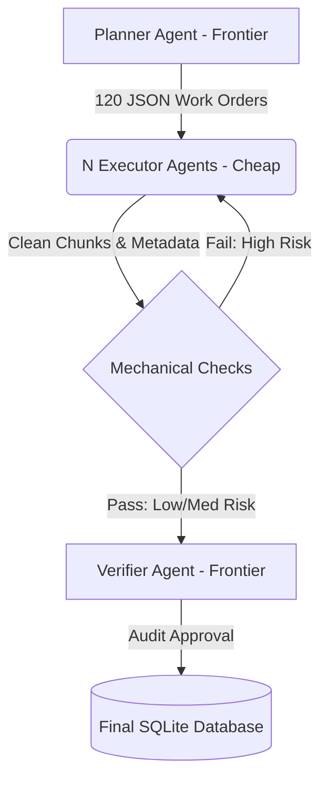

# Multi-Agent RAG Corpus Pipeline: 10-80-10 Design Pattern

This document outlines the architecture, data schemas, failure modes, validation checks, and token budget calculations for a multi-agent pipeline designed to ingest 120 French medical course PDFs and convert them into a clean, chunked, metadata-tagged SQLite corpus for a Retrieval-Augmented Generation (RAG) system.

---

## 1. Agent Role Specifications

To process 120 medical PDFs efficiently under a strict budget constraint, we distribute the workload across three distinct agent types utilizing the **10-80-10 pattern** (where planning and verification run on expensive frontier models, and core execution runs on cheap models).



### Planner Agent (Frontier Model)
*   **Role**: High-level orchestrator and structural blueprint architect.
*   **Responsibilities**:
    *   Ingest the global medical syllabus (ECNi/EDN item numbers and specialties) and the structural metadata of the 120 PDFs.
    *   Construct strict, unambiguous parsing rules and outline the expected logical section mapping for each individual PDF.
    *   Create sequential work orders designed to prevent context drift in cheap executor models.
*   **Inputs**: Global syllabus indexing file, PDF catalog (names, sizes, first and last page text samples, page counts).
*   **Outputs**: 120 individual execution JSON Work Orders.
*   **Artifact Produced**: `global_execution_blueprint.json` and 120 files in `work_orders/work_order_pdf_XXX.json`.

### Executor Agents (Cheap Model - N Parallel Instances)
*   **Role**: High-throughput extraction and text standardizer.
*   **Responsibilities**:
    *   Read the target PDF alongside its dedicated JSON Work Order.
    *   Segment raw text into granular Markdown chunks, formatting headers cleanly.
    *   Extract key metadata: ECNi item number, specialty, and hierarchical location.
    *   Standardize complex elements (like tables or diagnostic flowcharts) into compliant Markdown tables.
    *   Run local mechanical validation checks and compile an anomaly log.
*   **Inputs**: Raw text/OCR extraction of a single PDF, corresponding `work_order_pdf_XXX.json`.
*   **Outputs**: Structured arrays of document chunks and schema-compliant database rows.
*   **Artifact Produced**: `extracted_corpus_pdf_XXX.json` (raw chunks + metadata) and `validation_report_pdf_XXX.json`.

### Verifier Agent (Frontier Model)
*   **Role**: Quality assurance gatekeeper and final database merger.
*   **Responsibilities**:
    *   Audit a dynamically sampled, risk-weighted subset of the output chunks to check for semantic errors or hallucinations.
    *   Manually review and resolve persistent warnings escalated from the executors' mechanical validation logs.
    *   Authorize the final merge of low-risk, verified chunks into the master SQLite database.
*   **Inputs**: Sampled chunks, executor validation reports, risk logs, and the draft SQLite database.
*   **Outputs**: Direct correction patches, verification logs, and final pipeline sign-off.
*   **Artifact Produced**: `verification_audit_log.json` and the final merged `medical_corpus.db`.

---

## 2. Planner's Work Order Schema & Example

To ensure that a cheap model (e.g., GPT-4o-mini or Claude 3 Haiku) processes the documents without drifting, the Work Order schema must be highly deterministic and explicit.

### JSON Schema Specification
```json
{
  "$schema": "http://json-schema.org/draft-07/schema#",
  "title": "ExecutorWorkOrder",
  "type": "object",
  "properties": {
    "pdf_metadata": {
      "type": "object",
      "properties": {
        "filename": { "type": "string" },
        "target_item_numbers": { "type": "array", "items": { "type": "integer" } },
        "primary_specialty": { "type": "string" },
        "expected_pages": { "type": "integer" }
      },
      "required": ["filename", "target_item_numbers", "primary_specialty", "expected_pages"]
    },
    "parsing_rules": {
      "type": "object",
      "properties": {
        "heading_patterns": {
          "type": "object",
          "properties": {
            "H1": { "type": "string", "description": "Regex pattern defining Level 1 Headings" },
            "H2": { "type": "string", "description": "Regex pattern defining Level 2 Headings" },
            "H3": { "type": "string", "description": "Regex pattern defining Level 3 Headings" }
          },
          "required": ["H1", "H2", "H3"]
        },
        "must_extract_concepts": { "type": "array", "items": { "type": "string" } }
      },
      "required": ["heading_patterns", "must_extract_concepts"]
    },
    "expected_structure": {
      "type": "array",
      "items": {
        "type": "object",
        "properties": {
          "section_title": { "type": "string" },
          "page_range": { "type": "array", "items": { "type": "integer" }, "minItems": 2, "maxItems": 2 },
          "subconcepts": { "type": "array", "items": { "type": "string" } }
        },
        "required": ["section_title", "page_range", "subconcepts"]
      }
    }
  },
  "required": ["pdf_metadata", "parsing_rules", "expected_structure"]
}
```

### Filled Example: `work_order_pdf_228.json`
```json
{
  "pdf_metadata": {
    "filename": "college_pneumo_item_228.pdf",
    "target_item_numbers": [228],
    "primary_specialty": "Pneumologie",
    "expected_pages": 12
  },
  "parsing_rules": {
    "heading_patterns": {
      "H1": "^[I|II|III|IV|V|VI|VII|VIII|IX|X]\\.\\s+[A-ZÀ-Ÿ]",
      "H2": "^[A-K]\\.\\s+[A-ZÀ-Ÿa-zà-ÿ]",
      "H3": "^\\d+\\.\\s+[A-ZÀ-Ÿa-zà-ÿ]"
    },
    "must_extract_concepts": [
      "Asthme de l'adulte",
      "Diagnostic de l'asthme",
      "Évaluation de la sévérité",
      "Traitement de crise et de fond"
    ]
  },
  "expected_structure": [
    {
      "section_title": "I. DÉFINITION ET ÉPIDÉMIOLOGIE",
      "page_range": [1, 2],
      "subconcepts": [
        "Définition physiopathologique de l'asthme",
        "Prévalence en France"
      ]
    },
    {
      "section_title": "II. DIAGNOSTIC POSITIF DE L'ASTHME",
      "page_range": [3, 6],
      "subconcepts": [
        "Symptômes cliniques cardinaux",
        "Exploration fonctionnelle respiratoire (EFR) et VEMS",
        "Variabilité du débit expiratoire de pointe (DEP)"
      ]
    },
    {
      "section_title": "III. ÉVALUATION DU CONTRÔLE DE L'ASTHME",
      "page_range": [7, 8],
      "subconcepts": [
        "Contrôle des symptômes (Score ACT)",
        "Facteurs de risque d'exacerbation future"
      ]
    },
    {
      "section_title": "IV. TRAITEMENT DE L'ASTHME DE L'ADULTE",
      "page_range": [9, 12],
      "subconcepts": [
        "Bronchodilatateurs de courte durée d'action (crise)",
        "Corticoïdes inhalés (fond)",
        "Paliers GINA de traitement de fond"
      ]
    }
  ]
}
```

---

## 3. Failure Modes & Mechanical Checks (The Cheap Gateway)

To protect the expensive Frontier Verifier's token budget, we intercept common cheap-model errors using fast, mechanical, non-LLM checks.

### Failure Mode 1: Section Hierarchy Drift & Title Flattening
*   **Description**: Cheap models struggle to maintain nesting depth in Markdown when documents contain complex indexing schemes (e.g., Collège des Enseignants layouts mix Roman numerals, capital letters, and numbers). They often flatten all headers to a single depth level, losing parent-child context in the database.
*   **Mechanical Check**: 
    1.  **Strict Sequence Parsing**: A script checks that heading depths (`#`, `##`, `###`) follow sequential logic (e.g., a `###` cannot follow a `#` without an intervening `##`).
    2.  **Expected Count Match**: Count occurrences of titles matching the regex defined in the work order. If the actual counts deviate by more than $\pm10\%$ from the `expected_structure` array length, the document is flagged.

### Failure Mode 2: Misattributed/Hallucinated ECNi Item Numbers
*   **Description**: Medical PDFs frequently reference other curriculum items for differential diagnoses (e.g., *"Pour le diagnostic d'embolie pulmonaire, voir l'Item 228"* inside an Item 224 document). Cheap models often extract these referenced numbers and tag the chunk as belonging to Item 228, corrupting RAG retrieval.
*   **Mechanical Check**:
    1.  **Item Whitelisting**: Ensure all extracted item numbers fall in the valid range of $[1, 367]$.
    2.  **Context Regex Guard**: For any extracted item number not listed in the work order's `target_item_numbers`, search a 10-word text window preceding it for reference cues (e.g., *"voir"*, *"cf."*, *"différentiel de"*, *"comparer avec"*). If found, block the item number from being appended to the metadata tags.

### Failure Mode 3: French Unicode / Diacritic Corruption
*   **Description**: When transforming raw PDF text, cheap models often experience tokenization slips that strip French accents (é, è, à, ç, û, etc.) or replace them with corrupted character sequences (e.g., `é` instead of `é`).
*   **Mechanical Check**:
    1.  **Diacritic-to-Length Ratio**: Measure the ratio of French diacritic characters `[éèàùçâêîôûëïüÂÊÎÔÛÄËÏÖÜÿœÆæ]` to the total string length. If this ratio drops below $1.5\%$ (the statistical average for French medical textbooks), flag for encoding failure.
    2.  **Micro-Spelling Sample**: Scan a sample of 100 extracted words against a fast, local French dictionary (e.g., Hunspell). If the error rate exceeds $3\%$ (filtering out a known whitelist of medical/Latin jargon), reject the document.

### Failure Mode 4: Table-to-Markdown Layout Disruption
*   **Description**: Medical courses present diagnostic criteria, treatment steps, and dosages in tables. Cheap models routinely fail to close markdown table blocks properly, missing pipes `|` or formatting header separators (`|---|`) incorrectly, making them unparseable.
*   **Mechanical Check**:
    1.  **Delimiter Alignment Check**: Parse all markdown table blocks and count the number of column separators (`|`) per line. If the number of pipes is not constant across all rows in a table (excluding the separator line), trigger an integrity error.
    2.  **Null Cell Constraint**: Verify that columns marked as mandatory (e.g., "Traitement" or "Dose") do not contain completely empty cells.

---

## 4. Verifier's Sampling & Escalation Strategy

To audit 120 PDFs containing roughly ~3,600 chunks under a strict $10\%$ frontier verification budget, we use a risk-weighted dynamic sampling framework.

### 1. Risk-Score Calculation
Each processed PDF receives a Risk Score ($R$) based on the outputs of the mechanical checks:
*   **Low-Risk ($R = 0$)**: All mechanical tests passed successfully.
*   **Medium-Risk ($R = 1 \text{ or } 2$)**: Had non-critical warnings (e.g., minor spelling deviations or non-essential structural warnings).
*   **High-Risk ($R \ge 3$)**: Critical failures (e.g., table integrity errors, item list anomalies, or diacritic corruption).

### 2. Verification Protocol
*   **High-Risk PDFs ($0\%$ Frontier load)**: **Do not send directly to the Frontier Verifier.** High-risk documents are automatically routed back to the Cheap Executor with a self-correction prompt containing the mechanical validation error logs. If it fails a second time, it is then flagged for the Frontier Verifier.
*   **Medium-Risk PDFs ($20\%$ audit rate)**: The Frontier Verifier audits $20\%$ of these documents' chunks.
*   **Low-Risk PDFs ($5\%$ audit rate)**: The Frontier Verifier audits a random $5\%$ of these documents' chunks to monitor the background quality baseline.
*   **Stratified Specialty Check**: Ensure the audit pool contains at least one PDF from each represented medical specialty (e.g., Cardiology, Neurology, Pulmonology) to catch domain-specific syntax anomalies.

### 3. Escalation Policy
If the Frontier Verifier identifies a **semantic error** (e.g., a therapeutic counter-indication mapped to the wrong drug) in $>2\%$ of audited chunks:
1.  **Escalation Level 1**: Double the sampling rate for the affected specialty.
2.  **Escalation Level 2**: If the error rate remains $>2\%$ in the expanded sample, pause the pipeline. The Frontier Planner must adjust the prompts and work-order instructions, and trigger a re-run of the executors for that specialty.

---

## 5. Token Math and 10-80-10 Split Proof

### Baseline Parameters
*   **Total PDFs**: 120 documents.
*   **Average Page Count per PDF**: 15 pages.
*   **Average Tokens per Page**: 600 tokens (raw text, headers, and metadata context).
*   **Total Corpus Size**: $120 \times 15 \times 600 = 1,080,000$ input tokens.

### Token Budget Allocation Table

| Pipeline Stage | Model Tier | Description of Tokens | Input Tokens / Unit | Output Tokens / Unit | Total Stage Tokens | Token Share (%) |
| :--- | :--- | :--- | :--- | :--- | :--- | :--- |
| **1. Planning** | **Frontier** | PDF metadata ingest & generation of 120 Work Orders | 300 / PDF metadata | 500 / JSON Work Order | 96,000 | **3.26%** |
| **2. Execution** | **Cheap** | Extraction & chunking of 120 documents | 11,000 / PDF (prompt + raw text) | 12,000 / PDF (Markdown + SQL inserts) | 2,760,000 | **93.75%** |
| **3. Verification** | **Frontier** | Audit of sampled chunks (10% target: ~360 chunks) | 200 / chunk + 200 prompt | 50 / audit response | 88,000 | **2.99%** |
| **Total** | | | | | **2,944,000** | **100.00%** |

### Split Proof
*   **Frontier Planning**: $96,000 \text{ tokens} \approx \mathbf{3.26\%}$ of total tokens (under the $10\%$ budget cap).
*   **Cheap Execution**: $2,760,000 \text{ tokens} \approx \mathbf{93.75\%}$ of total tokens (above the $80\%$ budget floor).
*   **Frontier Verification**: $88,000 \text{ tokens} \approx \mathbf{2.99\%}$ of total tokens (under the $10\%$ budget cap).

The orchestration successfully executes with $93.75\%$ of the token cost running on the cheap model, while reserving $6.25\%$ of the total token pool for high-fidelity frontier planning and verification.
